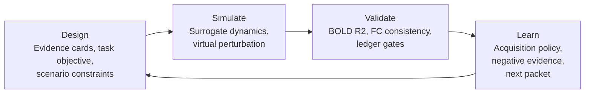

# NeuroTwin
[](https://github.com/Raphael-Camus/NeuroTwin/actions/workflows/ci.yml)
[](https://www.python.org/)
[](LICENSE)
[](#roadmap)

NeuroTwin is an AI4S surrogate-brain workflow prototype that turns ROI-level brain dynamics into a traceable **Design-Simulate-Validate-Learn (DSVL)** loop.

The current baseline uses synthetic fMRI-like ROI signals to demonstrate the workflow contract: train a lightweight brain dynamics surrogate, run virtual perturbations, score scientific readiness with validation gates, and emit the next validation packet for public-data follow-up.

> NeuroTwin is a research prototype. It does not make clinical, diagnostic, or treatment claims.

## DSVL Loop & Architecture



The baseline separates scientific responsibilities:

- **Design**: convert literature, data readiness, and scenario goals into structured evidence cards.
- **Simulate**: fit a surrogate model over ROI-level time series and run counterfactual perturbations.
- **Validate**: route each run through pass/watch/review/hold gates before stronger claims are made.
- **Learn**: rank next actions by fidelity, objective alignment, novelty, feasibility, and risk control.

## Quick Start

```bash
python -m venv .venv
source .venv/bin/activate
pip install -r requirements.txt
```

Generate the demo artifacts:

```bash
python scripts/run_demo.py
python scripts/prepare_public_validation.py
python scripts/prepare_public_validation.py --scenario emotion --tier 1 \
  --output-prefix public_validation_openneuro_smoke
```

Open the static dashboard:

```bash
python -m http.server 8769 --directory artifacts/demo
```

Then visit:

```text
http://127.0.0.1:8769/brain_twin_lab.html
```

The generated files under `artifacts/demo/` are intentionally ignored by Git because they are reproducible from source.

## Repository Structure

```text
NeuroTwin/
  README.md
  pyproject.toml
  requirements.txt
  src/neurotwin/              # Importable surrogate-brain primitives
  scripts/                    # Reproducible artifact-generation entry points
  docs/
    architecture/             # DSVL architecture and technical design
    validation/               # Public-data validation and ledger design
    evidence/                 # Evidence-card schema and literature backbone
    agent/                    # Agent-callable skill route
    learning/                 # Acquisition policy and next validation packet
    research/                 # Research plan and literature notes
    maintainer/               # Repo hygiene and publishing guidance
  data/                       # Local BIDS/open neuroimaging data placeholders
  artifacts/                  # Generated demo outputs, ignored by Git
  application_materials/      # Private application/pitch materials, ignored by Git
  references/                 # Bibliography notes; local PDFs are ignored
  tests/                      # Minimal regression tests
```

See [docs/maintainer/repo-organization-guide.md](docs/maintainer/repo-organization-guide.md) for the complete cleanup map.

## Baseline Scope

Implemented:

- synthetic ROI-level fMRI-like signal generation;
- ridge one-step surrogate dynamics;
- functional connectivity and virtual effective-connectivity estimation;
- three scenario contracts: emotional faces, cognitive control, closed-loop neuro experiment;
- validation ledger, public validation scaffold, agent skill registry, and next validation packet generation.

Not implemented yet:

- real BIDS/fMRIPrep ingestion;
- subject-level train/validation/test splits;
- uncertainty-calibrated Bayesian optimization;
- human expert review workflow;
- clinical endpoint validation.

## Roadmap

- **P1 public-data smoke test**: run ROI extraction, surrogate fitting, and validation ledger updates on one small OpenNeuro BIDS task-fMRI dataset.
- **Subject-aware surrogate**: add subject splits, held-out generalization metrics, and atlas robustness checks.
- **Uncertainty-aware acquisition**: replace transparent heuristic scoring with Bayesian optimization or active learning.
- **Human-in-the-loop gates**: add expert review records for behavior endpoints, clinical plausibility, and intervention constraints.
- **Agent-ready API**: expose DSVL stages as typed callable interfaces with replayable traces.

## License

MIT. See [LICENSE](LICENSE).
