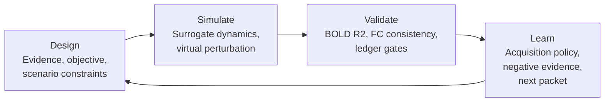

# NeuroTwin

[](https://github.com/Raphael-Camus/NeuroTwin/actions/workflows/ci.yml)
[](https://www.python.org/)
[](LICENSE)
[](#roadmap)

I built **NeuroTwin** as an AI4S surrogate-brain workflow prototype. My goal is to show how a brain-dynamics model can become a traceable **Design-Simulate-Validate-Learn (DSVL)** loop instead of a one-off prediction script.

The current baseline uses synthetic ROI-level fMRI-like signals. I use this synthetic layer deliberately: it lets me demonstrate the workflow contract, validation gates, perturbation logic, and next-experiment handoff without committing sensitive neuroimaging data or making clinical claims.

> NeuroTwin is my research prototype. It is not a medical device, and I do not use it for diagnosis, treatment planning, or patient-specific clinical decisions.

## What I Am Building

I treat NeuroTwin as a small virtual experiment system:



- **Design**: I turn literature signals, task context, and model assumptions into structured evidence.
- **Simulate**: I fit a surrogate over ROI-level brain activity and run virtual perturbations.
- **Validate**: I route every run through pass/watch/review/hold gates before I allow stronger interpretation.
- **Learn**: I convert the current run into a ranked next-action packet.

## Quick Start

```bash
python -m venv .venv
source .venv/bin/activate
pip install -r requirements.txt
```

Generate the demo artifacts:

```bash
python scripts/run_demo.py
python scripts/prepare_public_validation.py
python scripts/prepare_public_validation.py --scenario emotion --tier 1 \
  --output-prefix public_validation_openneuro_smoke
```

Open the static dashboard:

```bash
python -m http.server 8769 --directory artifacts/demo
```

Then visit:

```text
http://127.0.0.1:8769/brain_twin_lab.html
```

I ignore generated files under `artifacts/demo/` because they are reproducible from source.

## Developer Workflow

```bash
pip install -r requirements-dev.txt
make compile
make lint
make test
make demo
make validate
```

## Repository Structure

```text
NeuroTwin/
  src/neurotwin/              # Core surrogate-brain primitives
  scripts/                    # Reproducible artifact generation
  docs/                       # My design notes and system rationale
  tests/                      # Minimal regression tests
  data/                       # Local data placeholder; real data is ignored
  artifacts/                  # Generated demo outputs; ignored
  application_materials/      # Private pitch/submission material; ignored
  references/                 # Reference notes; local PDFs are ignored
```

Start with [docs/README.md](docs/README.md) for the documentation path.

## Current Baseline

What I have implemented:

- synthetic ROI-level fMRI-like signal generation;
- ridge one-step surrogate dynamics;
- functional connectivity and virtual effective-connectivity estimation;
- emotional faces, cognitive control, and closed-loop neuro experiment scenarios;
- validation ledger, public validation scaffold, agent workflow sketch, and next validation packet generation.

What I have not implemented yet:

- real BIDS/fMRIPrep ingestion;
- subject-level train/validation/test splits;
- uncertainty-calibrated Bayesian optimization;
- formal human expert review workflow;
- clinical endpoint validation.

## Roadmap

- **Public-data smoke test**: run the same loop on one small OpenNeuro BIDS task-fMRI dataset.
- **Subject-aware surrogate**: add subject splits, held-out generalization metrics, and atlas robustness checks.
- **Uncertainty-aware acquisition**: replace the transparent heuristic with Bayesian optimization or active learning.
- **Human-in-the-loop gates**: add expert review records for endpoint plausibility and safety constraints.
- **Agent-ready API**: expose DSVL stages as typed callable interfaces with replayable traces.

## License

MIT. See [LICENSE](LICENSE).
