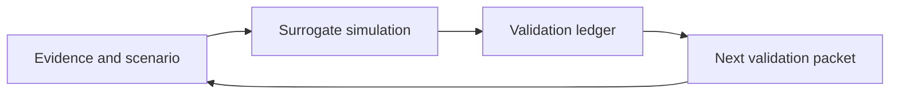

# Architecture Concept: Why I Built a DSVL Loop

I built NeuroTwin around a simple engineering judgment: a brain-modeling prototype is not useful if it only produces a score. It needs to show how a scientific question becomes a repeatable loop.

My loop is **Design-Simulate-Validate-Learn (DSVL)**:

- **Design**: I define the scenario, objective, evidence, and constraints.
- **Simulate**: I fit a surrogate brain and run virtual perturbations.
- **Validate**: I check fidelity, functional connectivity, objective shift, perturbation budget, and external evidence.
- **Learn**: I convert the result into a ranked next action and a next validation packet.

## The Problem I Am Solving

Neuroimaging projects often get stuck at correlation maps: one network is more active, another network is less connected, and the conclusion remains descriptive. I want NeuroTwin to push one step further. Given a candidate mechanism or intervention hypothesis, I want to ask:

- what network state should change?
- what uncertainty remains?
- what validation gate blocks a stronger claim?
- what should I run next?

I use synthetic ROI-level signals in the baseline because the system architecture is my first deliverable. Real data matters, but I do not want private or poorly documented data to obscure the workflow contract.

## My Design Principle

I separate speed from trust.

The surrogate can run many dry experiments quickly, but the validation ledger decides what the result means. This keeps the project honest: simulation is cheap, interpretation is gated.

