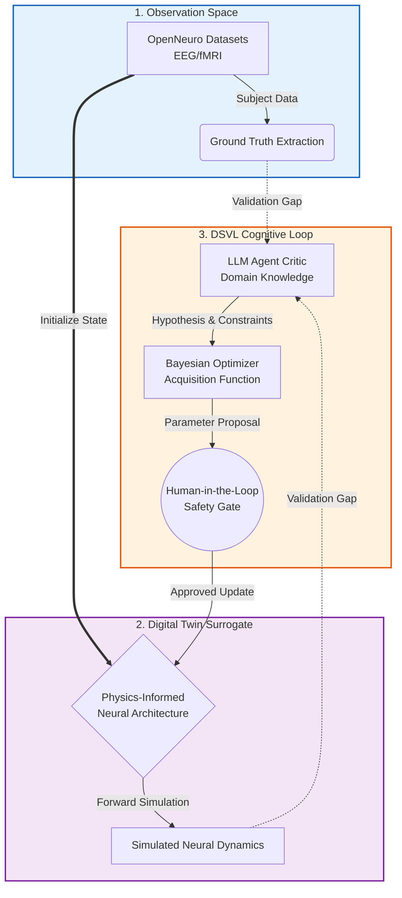

# NeuroTwin Architecture: The DSVL Concept

## 1. The Epistemic Dilemma: The "Data Wall" in Neuro-Intervention
Current computational neuroscience and neuro-engineering face a fundamental paradox: **The gap between data sparsity and intervention complexity.**

Traditional deep learning models require massive datasets to generalize, yet real-world neurological data is inherently scarce. More importantly, conducting iterative, trial-and-error interventions on living human brains (*in vivo*) to find optimal clinical or cognitive outcomes is strictly limited by ethical boundaries and physical constraints. We cannot "perturb" a real human brain thousands of times to observe the results. Consequently, conventional data-driven methods hit a "Data Wall."

## 2. The DSVL Breakthrough: In-Silico Trials for Precision Neuromodulation
To bridge this gap, NeuroTwin introduces the **Domain-Specific Validation Loop (DSVL)**. We transition the paradigm of neuro-intervention from costly physical trial-and-error to infinite digital exploration, a concept best illustrated through the optimization of Deep Brain Stimulation (DBS) for Parkinson's Disease.

The DSVL architecture breaks the "Data Wall" through a tri-fold mechanism:

### 2.1 The Hybrid Surrogate: Data Grounds, Physics Bounds
Instead of pure black-box deep learning, NeuroTwin constructs a **Subject-Aware Surrogate Brain**. In the context of Parkinson's, this means building a physics-informed dynamic model of the basal ganglia network. We use sparse, patient-specific data to calibrate the baseline. The underlying physical equations bound the system within biological reality, while the patient's data grounds the model in individual specificity.

### 2.2 Time/Space Compression via In-Silico Iterations
Finding the optimal DBS frequency *in vivo* takes months of clinical tuning. NeuroTwin compresses this timeline. By injecting thousands of virtual high-frequency perturbation sequences into the Surrogate Brain, a Bayesian Optimizer efficiently explores the massive parameter space in milliseconds, conducting cost-free, zero-risk *in-silico* clinical trials.

### 2.3 The Cognitive Loop: LLM as the "Virtual Neurologist"
A purely mathematical optimizer might find a frequency that stops tremors but triggers dangerous side effects. We embed an **LLM-driven Agent** directly into the optimization loop. Acting as a domain-expert critic, the Agent semantically evaluates the simulated neural trajectories. It validates whether the virtual response makes *clinical and scientific sense*, elevating the system to an Automated Scientific Discovery Engine.

## 3. The Information Topology

