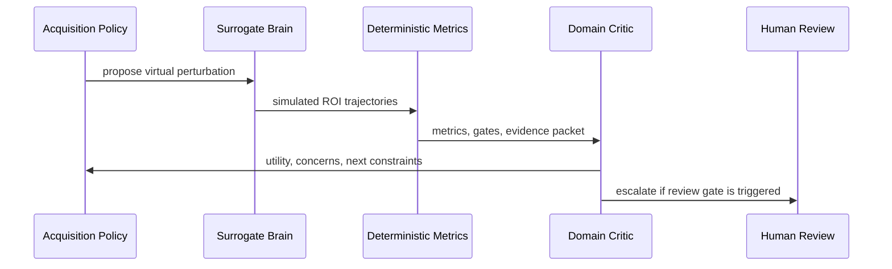

# Agent Workflow

I designed the agent layer as a reviewer of structured evidence, not as a black-box oracle.

The mistake I want to avoid is sending raw neural time series directly into a language model and asking for scientific conclusions. That would be brittle and hard to audit. My workflow keeps numerical work deterministic and lets the agent reason only over compressed, explicit summaries.

## Sensory Layer

The Python pipeline acts as the sensory layer. It computes:

- signal fidelity;
- functional-connectivity consistency;
- perturbation response;
- objective delta;
- budget and risk indicators;
- review-gate status.

This layer produces structured JSON and Markdown artifacts. Those artifacts are what a future agent should inspect.

## Domain Critic

The agent acts as a domain critic. It can ask:

- does this simulated response match the declared objective?
- is the uncertainty too high?
- does the perturbation violate a constraint?
- should this result trigger human review?
- what should the next validation packet contain?

The agent should not make clinical claims. In my design, it assigns scientific utility and review priority, then routes the result back into the DSVL loop.

