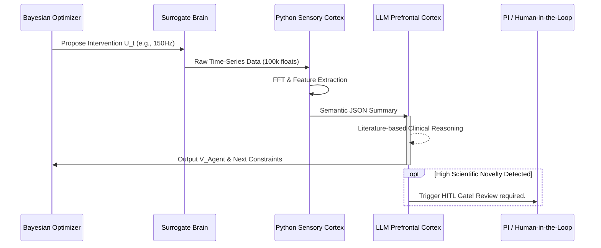

# 3. Agent Cognitive Framework: The Neurosymbolic Workflow

To evaluate the massive, high-frequency *in-silico* interventions generated by the DSVL, NeuroTwin employs a **Neurosymbolic Hybrid Agent Architecture**.

We explicitly reject the naive approach of feeding raw, high-dimensional time-series data directly to Large Language Models (LLMs). Such an approach inevitably leads to context-window overflow, high computational costs, and severe "numerical hallucinations." Instead, we design our Agent loop mimicking the human brain's hierarchical processing: pairing a deterministic **Sensory Cortex** (Python Signal Pipeline) with a semantic **Prefrontal Cortex** (LLM Critic).

## 3.1 The "Sensory Cortex": Feature Extraction Pipeline
Before the LLM sees any data, the raw virtual outputs (e.g., $S_{t+1}$) from the Surrogate Brain must pass through a rigorous, deterministic signal processing layer.

Written in Python (utilizing `scipy` and `mne`), this layer acts as the system's "Sensory Cortex." It ingests raw floating-point arrays and performs heavy mathematical lifting:
*   **Spectral Analysis:** Fast Fourier Transforms (FFT) to calculate power spectral density (PSD) across specific frequency bands (e.g., $\alpha, \beta, \gamma$).
*   **Biomarker Detection:** Quantifying specific clinical indices, such as the Parkinsonian Tremor Index or synchronization likelihood.
*   **State Compression:** Compressing $10^5$ data points into a concise, highly semantic JSON feature summary.

## 3.2 The "Prefrontal Cortex": LLM as the Clinical Critic
Once the data is compressed into a semantic JSON, it is passed to the LLM (the "Prefrontal Cortex"). The LLM's role is strictly cognitive: it applies its vast repository of medical and neuroscientific literature to evaluate the clinical viability and scientific novelty of the intervention.

**Example Intervention Prompt to the Agent:**
```json
{
  "intervention_params": {"dbs_frequency_hz": 150, "amplitude_v": 2.5},
  "sensory_cortex_features": {
    "beta_band_power_reduction": "68.5%",
    "tremor_index_change": -0.42,
    "gamma_band_anomaly": true,
    "gamma_power_increase": "310%"
  }
}
```

**System Prompt Directive:**
> "You are the NeuroTwin Lead Neurologist Agent. Evaluate the sensory features of this virtual DBS intervention. Your objective is to maximize therapeutic efficacy (Beta suppression) while strictly avoiding cognitive side-effects (Gamma anomalies). Output a Scientific Utility Score $\mathcal{V}_{\text{Agent}}$ (0.0 to 1.0) and propose the next Bayesian prior adjustment."

## 3. The Action Space & Safety Gates
Based on the semantic reasoning, the Agent executes actions within the DSVL:

*   **Assign $\mathcal{V}_{\text{Agent}}$:** This scalar value is fed back into the Bayesian Optimizer's Acquisition Function, guiding the next intervention proposal.
*   **Adjust Constraints:** If the Agent detects biological impossibilities, it dynamically shrinks the optimizer's search space.
*   **Trigger Human-in-the-Loop (HITL):** If the Agent identifies a highly anomalous but clinically promising state (e.g., a novel resonance frequency that suppresses tremors with zero side effects), it halts the loop and flags the JSON output for human Principal Investigator (PI) review.

## 4. Workflow Topology


