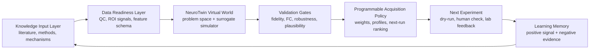

# Platform Architecture Map

NeuroTwin fits an AI4S platform as a callable virtual experiment capability between upstream scientific evidence and downstream validation workflows.

## Mermaid View

## Layer Responsibilities

| Layer | Responsibility |
| --- | --- |
| Knowledge input layer | Collect evidence and candidate methods for Design. |
| Data readiness layer | Convert raw data and metadata into validated model inputs. |
| NeuroTwin virtual world | Run surrogate brain simulation and virtual perturbation. |
| Validation gates | Record fidelity, robustness, plausibility and cost signals. |
| Programmable acquisition policy | Rank the next action under configurable operating preferences. |
| Next experiment | Define dry-run, human review or downstream validation action. |
| Learning memory | Keep successful signals and negative evidence for the next DSVL cycle. |

## Company-Fit Reading

This architecture makes NeuroTwin look like an AI4S platform capability: it has inputs, executable simulation, validation gates, policy state, trace memory and a path to downstream experimental feedback.
